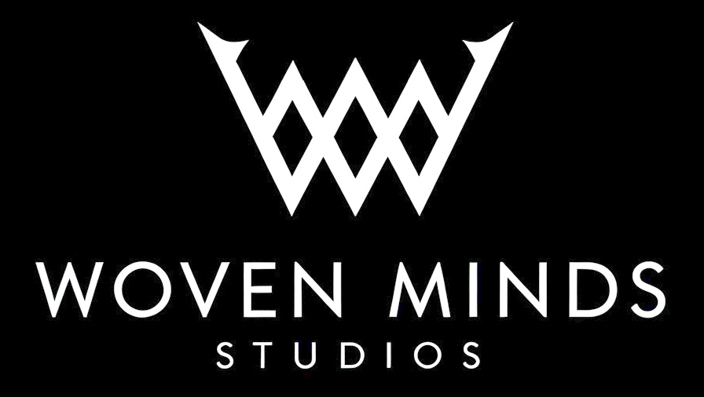

  <h1>Woven Minds Studios</h1>

  
Welcome to the official GitHub organization for Woven Minds Studios, developers of the psychological horror MMO "Woven Thoughts".

  

We're a small, passionate team building an immersive world where abstract concepts gain physical form and hunt their thinkers.

  

## 🌐 Our Vision

We're creating a unique MMO experience that blends psychological horror with innovative gameplay mechanics centered around thought manifestation. In our world, thinking the wrong thought can create entities that hunt you, memories can be stolen, and identity is something to be protected at all costs.

Our goal is to deliver a game that:
- Creates genuine unease through psychological horror rather than just jump scares
- Offers unique gameplay mechanics where mental states affect the world
- Builds a community around shared experiences of horror and survival
- Pushes the boundaries of what an MMO can be
- Maybe even pull some heart strings along the way

## 👥 The Team

We're currently a small but dedicated team of two C++ developers with a passion for horror and innovative gameplay:

- **Alex Mollard** - CEO, Lead Developer & Concept Creator
  - 6+ years C++ experience
  - Game architecture specialist
  - C++ Programmer
  - Network Engineer
  - Producer
  
- **Connor Young** - Systems Developer
  - C++ programmer
  - Audio implementation
  - Devops
  - QA

*We're passionate about building something unique, and while our team is small, our ambition is not.*

## 🛠️ Technology Stack

- **Core Engine:** Custom C++ game engine
- **Networking:** C++ using ENet for reliable packets
- **Database:** PostgreSQL for persistent world data
- **Client Interface:** Custom Vulkan rendering
- **Build System:** MSBuild
- **Version Control:** Git
- **CI/CD:** GitHooks but might move to GitHub actions

## 📝 Development Status

We're currently in early development, focusing on:

1. Core engine architecture
2. Conceptual manifestation systems
3. Networking foundations
4. Basic world building tools
5. Early prototype gameplay

Our internal alpha milestone is targeted for 2026.

## 🤝 Contributing

While we're currently a small core team focused on building our foundation, we're open to collaborations and contributions in specific areas:

- Concept art
- Sound design
- Lore writing
- 3D modeling
- Animation
- Anything really, we only know how to program

If you're interested in contributing, please email us at [WovenMindsStudios@protonmail.com](mailto:WovenMindsStudios@protonmail.com) with samples of your work or if you'd wanna talk about our mmo.

## 📢 Contact Us

- **Email:** [WovenMindsStudios@protonmail.com](mailto:WovenMindsStudios@protonmail.com)
- **Discord:** [discord.gg/wovenminds](https://discord.gg/M4aKNG2WP2)

---

  
  
<i>Where memories become monsters</i>

  
© 2025 Woven Minds Studios. All rights reserved.

